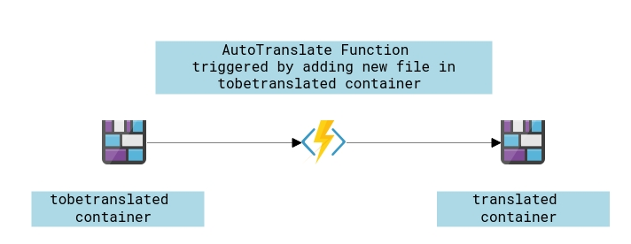

# AutoTranslateBlobs
This is an Azure Function to Auto Translate HTML and Text files once they arrive in an Azure Blob container. Then store the translated one in a different container.

<p align="center">
  
</p>

# Challenges
- Maintain the structure of HTML document.
- Address the API Limit of 5000 charcters per call, so we need to slice the content.

# Requirments
You need to provide the following configuration or app settings either from the portal or by creating "local.settings.json" to test locally.
```
    "AzureWebJobsStorage": "",
    "FromLang": "English",
    "ToLang": "Arabic",
    "AzureTranslateKey": "",
```
# Known Limitations
- Areas of improvments for handling complex HTML documents.
- One Input language and one target language. There a posibility to fan-out to many target languages.

# Credits
I ported the "TranslationAssistant.TranslationServices.Core" from "DocumentTranslator" to dotnet standard to be able to use it in Functions runtime.

DocumentTranslator: https://github.com/MicrosoftTranslator/DocumentTranslator

# Porting to .Net standard 3.0
https://devblogs.microsoft.com/dotnet/how-to-port-desktop-applications-to-net-core-3-0/
https://devblogs.microsoft.com/dotnet/are-your-windows-forms-and-wpf-applications-ready-for-net-core-3-0/
